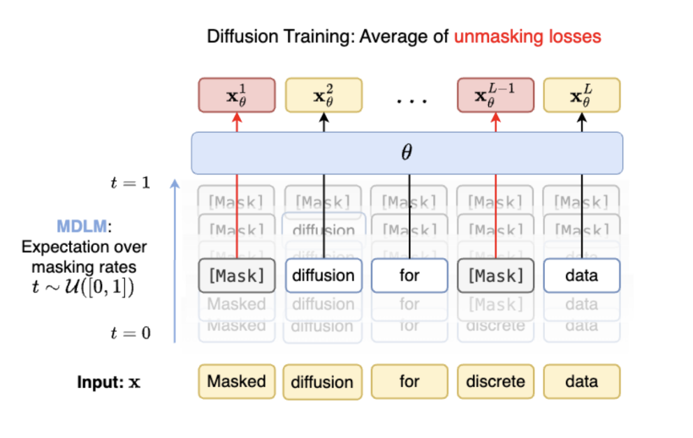

# Masked Diffusion Language Modeling (MDLM) for Conditional Small Molecule Generation

    <video autoplay muted loop playsinline>
        <source src="smiles-mdlm-animation.mp4" type="video/mp4">
        Your browser does not support the video tag.
    </video>

## Introduction

Most pharmaceuticals are small molecules, and their therapeutic success depends on properties such as binding strength, specificity, and ADMET. MDLM explores text-guided molecular generation, using discrete diffusion methods to preserve molecular validity while optimizing properties.

## Why Diffusion?

Unlike traditional autoregressive (AR) models, diffusion methods allow nonsequential generation, better reflecting the non-linear structure of molecules. This makes diffusion particularly suited for tasks like conditional molecule generation, where properties need to be optimized without sacrificing diversity.

## Why Discrete Diffusion?

SMILES and other molecular representations are inherently discrete, making it intuitive to work in discrete spaces. MDLM applies iterative masking (noise) and unmasking (denoising) processes, effectively adapting diffusion methods to this discrete domain.

*Diagram illustrating MDLM noising and denoising process (Source: [Sahoo, 2024](https://s-sahoo.com/mdlm/)).*

## Modifications Implemented

1. **Atom Group SMILES Tokenizer**: Explicit tokenization for better SMILES generation.
2. **DiT Text Guidance**: Cross-attention added for text guidance using BERT embeddings.
3. **Upweighted EOS Token**: Enhanced length prediction via adjusted loss weighting.
4. **Validity Tuning**: Differentiable loss terms for SMILES grammar validity.
5. **Negative Infinity Logit Bug Fix**: Resolved issues causing unstable training and NaNs.

## Results and Conclusions

Although MDLM achieved moderate BLEU scores, it significantly underperformed compared to continuous diffusion models in terms of validity. Improvements in discrete diffusion methods are needed for better results in structured tasks like molecular generation.

| Model                              | BLEU Score | Validity (%) |
|------------------------------------|------------|--------------|
| AR Transformer                     | 0.422      | 90.6         |
| TGM-DLM (Continuous Diffusion)     | 0.828      | 78.9         |
| SMILES-MDLM                        | 0.678      | 0.0          |
| SMILES-MDLM (with validity tuning) | 0.664      | 16.7         |

*Results for AR Transformer and TGM-DLM taken from [Gong, 2024](https://arxiv.org/html/2402.13040v1).*

### Key Insights

1. **Structured Output Remains Challenging**: MDLM struggles with tasks requiring strict adherence to structured grammars, such as valid SMILES generation.
2. **Small Vocabulary Limitation**: The constrained vocabulary size in SMILES representations amplifies errors, reducing MDLM’s effectiveness compared to AR models.

## References

- Full explanation of MDLM: [Sahoo, 2024](https://s-sahoo.com/mdlm/)
- Original MDLM arXiv paper: [arxiv.org/abs/2406.07524](https://arxiv.org/abs/2406.07524)
- Hugging Face: [MDLM on Hugging Face](https://huggingface.co/mhla/smiles-mdlm/tree/main)

---

Full writeup here: (https://michaelhla.com/smiles-mdlm)
